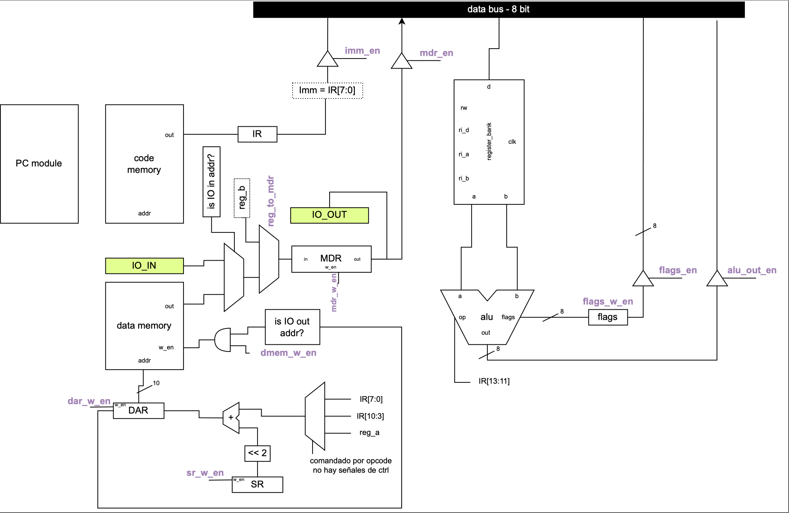

## DiBU: Digilent Based Unit

DiBU is an 8-bit academic processor, with a custom RISC-like ISA. The initial goal of the design was to get to a processor capable of running a game similar to [Simon](https://en.wikipedia.org/wiki/Simon_(game)). 

The ISA is RISC-like with regards to it's integer opeartions, load/store for memory accesses, has two memory mapped IO ports, and has a special instruction for generating random numbers.

The implementation has a multi-cycle micro-programmed control unit. To make it easily modifiable, the microprogram itself and the control-unit's input/output signals are generated from a [Python description](https://github.com/thepalbi/dibu-architecture/blob/main/dibu/microprogram.py#L14).

The design contains a test-benches developed with [Cocotb](https://www.cocotb.org/), and was tested in a Xilinx FPGA development board.

</img>